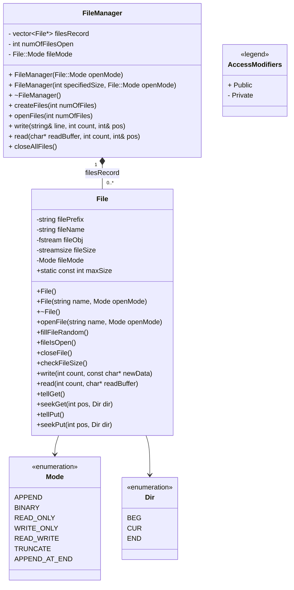

# File Handling

## Class Diagram

## Explanation

This project's main purpose is to have a large file which is composed of multiple small files. Each small file should not exceed the maximum size. The large file will navigate to the correct file corresponding to the byte number. Then it can either read bytes from there or write character bytes there, overwriting the previously written data. The large file will know when it has reached the end of the current small file and switches to the next file. The large file is represented by the `FileManager` class and the small file by `File` class.