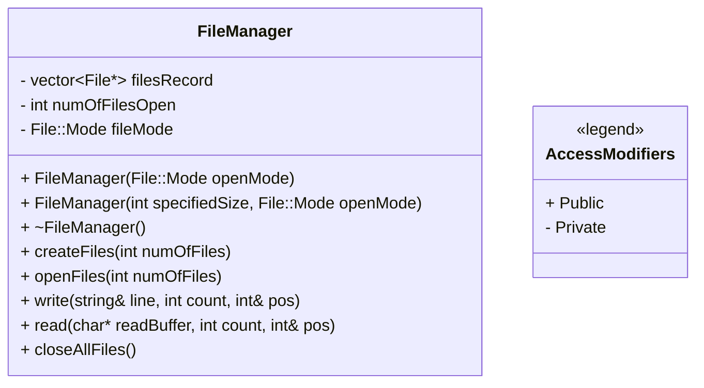

# FileManager Class

## Class Diagram

## Explanation

The `FileManager` class acts as one large file which is composed of multiple smaller files. Its the responsibility of the `FileManager` class to create the required number of files and write or read data from the specified byte location.

## Class Members

- `vector<File*> filesRecord`: Keeps track of the file handles of the opened files.
- `numOfFilesOpen`: Tracks the number of opened files.
- `fileMode`: The file mode in which the all the smaller files are opened.

## Class Methods

- `FileManager(File::Mode openMode)`: Constructor to only specify file opening mode without creating any files
- `FileManager(int specifiedSize, File::Mode openMode)`: This Constructor creates the required number of files to store `specifiedSize` bytes. The files are also opened in the specified mode.
- `~FileManager()`: Destructor that closes all files.
- `createFiles(int numOfFiles)`: Creates the number of files specified with the name "test*.txt" ('*' represents a number) and opens them in `fileMode`.
- `openFiles(int numOfFiles)`: Wrapper for `createFiles()`.
- `write(string& line, int count, int& pos)`: Writes the string in `line` at the specified `pos` byte and overwrites the previous data there. Only `count` number of character are written in the file.
- `read(char* readBuffer, int count, int& pos)`: Reads `count` bytes from the specified `pos` byte number into the `readBuffer` char array.
-  `closeAllFiles()`: CLoses all the file handles in `filesRecord`.  
