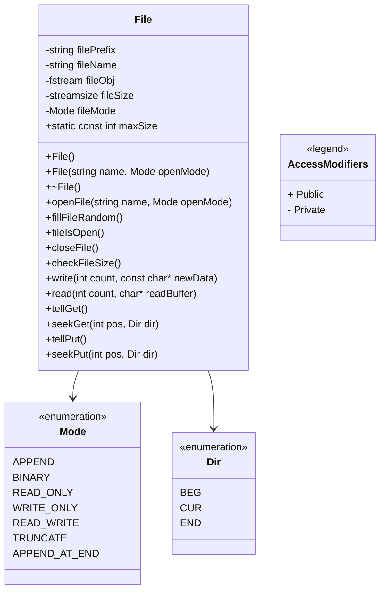

# LocalFile Class

## Class Diagram

## Explanation

The `File` class provides a set of basic methods for working with local files in a C++ application. It is effectively a wrapper for `std::fstream` class 

## Class Members

- `filePrefix`: A string used to specify relative directory path, with respect to the build folder, to create and open files.
- `fileName`: A string that has the name of the file opened.
- `fileObj`: An `fstream` object that represents the file handle.
- `fileSize`: Contains the size of the file opened in bytes.
- `fileMode`: The mode in which the file was opened.
- `maxSize`: Represents the maximum allowed file size.

## Class Methods

- `File()`: The default constructor for the `File` class.
- `File(string name, int openMode)`: Constructor that opens/creates a file using the name the given in the specified mode.
- `~File()`: The destructor for the `File` class. It closes the file object.
- `openFile(string name, int openMode)`: Opens/Creates a file with the specified name and open mode.
- `fileIsOpen()`: Checks if the file is currently open.
- `closeFile()`: Closes the file if its open.
- `fillFileRandom()`: Fills the file with random data up to the `maxSize` bytes.
- `checkFileSize()`: Checks the size of the file in binary mode.
- `write(int count, const char* newData)`: Writes the specified number of bytes from the provided char buffer to the file. It overwrites the previous data in the file starting from the current write position in the file. 
- `read(int count, char* readBuffer)`: Reads the specified number of bytes from the file into the provided char buffer.
- `tellGet()`: Returns the current read position in the file.
- `seekGet(int pos, int dir)`: Sets the read position in the file to the specified position by using the specified direction.
- `tellPut()`: Returns the current write position in the file.
- `seekPut(int pos, int dir)`: Sets the write position in the file to the specified position by using the specified direction.

## Enum Classes

There are 2 enum classes defined inside the `File` class to help the user with specifying file open modes and to set the read and write position inside the file. Each enum name is derived from the `ios` class.

### `enum class Mode`:

- `APPEND`: `ios::app` 
- `BINARY`: `ios::binary | ios::in | ios::out` if file already exists otherwise `ios::binary | ios::out`.
- `READ_ONLY`: `ios::in`
- `WRITE_ONLY`: `ios::out`
- `READ_WRITE`: `ios::in | ios::out`
- `TRUNCATE` : `ios::trunc | ios::out`
- `APPEND_AT_END`: `ios::ate | ios::in | ios::out`

### `enum class Dir`:

- `BEG`: `ios::beg`
- `CUR`: `ios::cur`
- `END`: `ios::end`